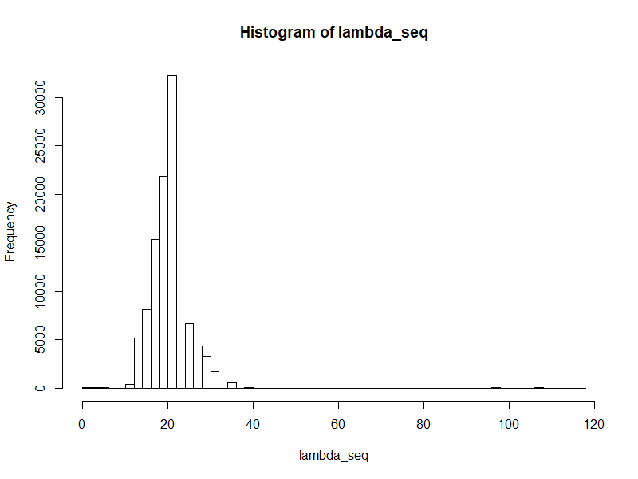

# 第5章

## LASSO CV
- LASSOのCross-Validationを行って最適なλを見つける
- Pythonではsklearnに含まれるlassocvを実施すれば良い
- Rならばglmnetを使えば良い
  - Pythonにもglmnetがあるが、Rとはだいぶ使い勝手が違う

## Rのglmnetの挙動について
- 10-folds CVを実施すると、実施ごとに得られるλの値が異なる
  - Pythonのsklearnでやると毎回同じ値になる。このあたりの挙動の違いも気になる。
- おそらくCVを実施する際のデータセットのばらつきによるものではないかと思われる
  - 特に本文で実施している解析対象は50obsしかないため、偏りがでやすい
  - でもCVしているのだからそんなにばらつくことはないのじゃないか？とも思うのだが。。。
- 以下にλの分布を示した

